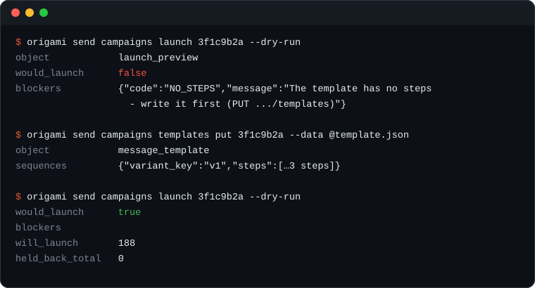

<div align="center">

<picture>
  <source media="(prefers-color-scheme: dark)" srcset=".github/assets/origami-cli-logo-dark.svg">
  
</picture>

<h3>The command line for the Origami API</h3>

<p>Every <a href="https://docs.origami.chat/v3/overview">v3</a> operation is a command:
campaigns, people, templates, leads, jobs, account.<br>
Generated from Origami's published OpenAPI spec, so it covers the whole API and stays current.</p>

<p>
  <a href="https://www.npmjs.com/package/@braingrid/origami-cli"></a>
  <a href="https://github.com/BrainGridAI/origami-cli/actions/workflows/ci.yml"></a>
  <a href="LICENSE"></a>
  
  
</p>

<p>
  <a href="#install">Install</a> ·
  <a href="#quickstart">Quickstart</a> ·
  <a href="#v3-send-leads-jobs-account">Commands</a> ·
  <a href="https://docs.origami.chat/">Origami docs</a> ·
  <a href="CONTRIBUTING.md">Contributing</a>
</p>

<p><sub>Built by the team behind <a href="https://www.braingrid.ai/?ref=origami-cli">BrainGrid</a>,
<a href="https://www.plansmith.co/?ref=origami-cli">Plansmith</a> and
<a href="https://www.radial.build/?ref=origami-cli">Radial</a>.</sub></p>



</div>

## Why origami-cli

- **The whole API.** All 120 v3 operations are commands, built from
  [Origami's OpenAPI spec](https://docs.origami.chat/openapi-v3.yaml). When Origami ships a
  change, `pnpm sync:v3` regenerates the catalog; nothing is hand-maintained.
- **Checks before it sends.** Enum values and required fields are validated before any request
  leaves your machine. `launch --dry-run` shows the exact blockers a real launch would hit.
- **Safe to retry.** Every POST carries an `Idempotency-Key` that is reused across automatic
  retries, so a flaky network never launches a campaign or enrolls a list twice.
- **Built for scripts.** JSON when piped, tables in a terminal, CSV on request. `--all` follows
  cursors to the end, and data goes to stdout while progress goes to stderr.
- **Async done right.** Anything that returns a Job takes `--wait`, which polls on the Job's own
  `next_poll_at`. `origami jobs wait <id>` picks up any Job later.

## Install

```bash
npm install -g @braingrid/origami-cli     # puts `origami` on your PATH
npx @braingrid/origami-cli --help         # or run it without installing
```

Requires Node.js 18+. From source: `pnpm install && pnpm build && npm link`.

## Quickstart

```bash
origami auth login                                          # paste an og_live_… key
origami send campaigns list --status draft                  # what's waiting to go out
origami send campaigns examples list <campaignId>           # the copy each person will get
origami send campaigns launch <campaignId> --dry-run        # blockers + held-back counts
origami send campaigns launch <campaignId>                  # go
origami send campaigns stats <campaignId>
```

## Authenticate

Create an API key under **Settings → Developers** in the [Origami app](https://origami.chat). Keys
look like `og_live_…` and are **parent-wide** (they can act on your org or any of its projects).

```bash
origami auth login                    # prompts for a key (hidden input), verifies it
origami auth login --key og_live_…    # non-interactive
echo "$KEY" | origami auth login      # from a pipe / secret manager
origami auth login --project <id>     # store a default project (child org) scope
```

Inspect or rotate:

```bash
origami auth status                   # resolved profile (key masked) + plan
origami auth logout                   # forget the active profile's key
```

The key can also come from the environment (handy for CI):

```bash
export ORIGAMI_API_KEY=og_live_…
origami account
```

## The core loop

Origami is agentic: you send a brief, an agent researches it in the background and builds a table,
then you read the rows.

```bash
# 1. Run a brief (creates an agent, polls to completion, prints the table)
origami run "Find 20 fintech CEOs in NYC" --model max

# 2. If the agent asks a question, answer it (same agent + conversation)
origami agents ask <agentId> "Only Series A and later, please"

# 3. Read the rows it built
origami tables rows <tableId>
origami tables rows <tableId> -o csv --out leads.csv     # export to a file

# 4. Bring your own data — upsert + enrich
origami tables upsert <tableId> --match domain \
  --row '{"domain":"acme.com"}' --row '{"domain":"globex.com"}'
origami enrichments get <enrichmentRunId> --wait          # poll until settled
```

`origami run` and `origami agents create` are the same flow; `run` is the friendly shortcut. Add
`--no-wait` to return the running run id instead of polling, then poll later with
`origami agents run-get <agentId> <runId> --wait`.

## Global options

Place these **after** the command (kubectl-style):

| Option | Description |
| --- | --- |
| `--api-key <key>` | API key (overrides profile/env) |
| `--project <id>` | scope the request to a project (child org) via `x-origami-project` |
| `--profile <name>` | configuration profile |
| `--base-url <url>` | override the API base URL |
| `-o, --output <format>` | `table` (default in a terminal), `json` (default when piped), or `csv` |
| `--fields <list>` | comma-separated columns to show (table/csv) |
| `--no-color` | disable colored output (also honors `NO_COLOR`) |
| `--debug` | log HTTP requests to stderr |
| `--timeout <ms>` | per-request timeout |
| `--max-retries <n>` / `--no-retry` | control automatic retries on 429/5xx |

Data goes to **stdout**; status, progress, and hints go to **stderr** — so `| jq` and `-o csv`
pipelines stay clean.

## Commands

### `run` / `agents`

```bash
origami run "<brief>" [--model lite|max] [--workspace <id>] [--table <id>]... [--rows] [--no-wait]
origami agents list [--search <text>] [--all]
origami agents get <agentId>
origami agents ask <agentId> "<follow-up>"
origami agents runs <agentId>
origami agents run-get <agentId> <runId> [--wait] [--include stats,transcript]
origami agents tables <agentId>
origami agents cancel <agentId>
origami agents archive <agentId>
```

### `tables`

```bash
origami tables list [--workspace <id>] [--all]
origami tables get <tableId> [--include stats]
origami tables columns <tableId>
origami tables rows <tableId> [--filter '<col> <op> [value]']... [--sort <col>:<asc|desc>] \
                              [--flat] [--no-defaults] [--limit <=200] [--all] [-o csv] [--out file.csv]
origami tables row <tableId> <rowId>
origami tables cell <tableId> <rowId> <columnId>
origami tables upsert <tableId> --match <slugs> (--row '<json>'... | --file rows.csv) \
                              [--no-enrich] [--reenrich-updated] [--batch-id <uuid>]
```

Filter operators: `contains`, `not_contains`, `equals`, `not_equals`, `is_empty`, `is_not_empty`,
`greater_than`, `greater_than_or_equal`, `less_than`, `less_than_or_equal`.

### `enrichments`, `documents`, `workspaces`

```bash
origami enrichments list [--table <id>] [--all]
origami enrichments get <runId> [--wait]

origami documents list <workspaceId>
origami documents upload <workspaceId> <file...> [--mode table|append|document] [--table <id>]
origami documents get <workspaceId> <documentId> [--out <file>]
origami documents rename <workspaceId> <documentId> <name>
origami documents delete <workspaceId> <documentId>

origami workspaces list
origami workspaces create --name <name>
origami workspaces get <workspaceId>
origami workspaces delete <workspaceId> [--confirm]
```

### v3: `send`, `leads`, `jobs`, `account`

Each operation id is the command path: `send.campaigns.people.list` is
`origami send campaigns people list`, `fetch_more` becomes `fetch-more`. A group whose only
operation is `get` collapses into the group (`origami send campaigns stats <id>`), and an
argument-free `get` is its group's default (`origami account`, `origami account credits`).

```bash
# The send recipe, in order
origami send campaigns create --name "Q4 delivery leaders" --channels linkedin
origami send campaigns people upsert <campaignId> --list-id <listId>
origami send campaigns templates put <campaignId> --data @template.json
origami send campaigns settings patch <campaignId> --no-auto-lead-refill-enabled --require-message-approval
origami send campaigns senders add <campaignId> --sender-id <senderId>
origami send campaigns examples list <campaignId>                # read the rendered copy per person
origami send campaigns launch <campaignId> --dry-run             # blockers + held-back counts
origami send campaigns launch <campaignId>
origami send campaigns stats <campaignId>

# Leads
origami leads lists list
origami leads lists rows list <listId> --all -o csv > rows.csv
origami leads lists rows upsert <listId> --rows @rows.json --match-columns email
origami leads searches create --brief "…" --count 25 --wait

# Jobs: every 202 returns one; --wait on the command, or poll later
origami jobs list --status running
origami jobs wait <jobId>
origami jobs input <jobId> --answers "Only Series A and later"

# Account
origami account senders list --channel linkedin
origami account rate-limits
origami account exclusion-lists people add --email someone@example.com
```

How flags map to the API:

- Path parameters are positional arguments; query parameters and top-level body fields are
  `--kebab-case` flags. `origami <command> --help` lists them with the spec's descriptions and
  ends with the HTTP call and its docs page.
- Booleans take `--flag` or `--no-flag` (sends `false`). Lists take commas or repeats
  (`--ids a,b --ids c`). Object fields take JSON inline, `@file.json`, or `-` for stdin.
- `--data <json|@file|->` supplies the whole body; flags override its keys. A body field that
  would shadow a global option gets a `body-` prefix (`--body-fields`).
- Enums and required fields are checked before any request is sent.
- Every POST carries an `Idempotency-Key` (yours via `--idempotency-key`, else a UUID) that is
  reused across automatic retries, so a retried launch or enrollment never runs twice.
- List commands print one page and hint the cursor; `--all` follows `next_cursor` to the end.
- Operations that return a Job accept `--wait` (polls on the Job's `next_poll_at`, default
  ceiling 30 minutes, `--wait-timeout <s>` to change it).

Regenerate the command catalog when Origami ships spec changes:

```bash
pnpm sync:v3              # fetches https://docs.origami.chat/openapi-v3.yaml → src/v3/catalog.ts
pnpm sync:v3 ./spec.yaml  # or from a local copy
```

### `campaigns`, `sequences` (v2)

```bash
origami campaigns list (--workspace <id> | --table <id>)
origami campaigns create <tableId> "<instructions>"     # agentic — drafts sequences, doesn't send
origami campaigns edit <campaignId> "<change>"          # agentic
origami campaigns people <campaignId> [--status <csv>] [--all]
origami campaigns stats <campaignId>
origami campaigns launch <campaignId> [--dry-run]       # also: pause / resume
origami campaigns delete <campaignId> [--confirm]

origami sequences list (--workspace <id> | --table <id> | --column <id>) [--status <s>]
origami sequences get <sequenceId>
origami sequences stop <sequenceId> [--dry-run]
origami sequences delete <sequenceId> [--force]
```

### `scheduled`, `projects` (v2)

```bash
origami scheduled list [--workspace <id>] [--enabled true|false]
origami scheduled create --workspace <id> --name <n> --prompt "<brief>" --cron "0 9 * * 1"
origami scheduled enable|disable|trigger <id>
origami scheduled runs <id>

origami projects list                                   # parent-org only
origami projects create <name> [--monthly-credits <n>]
origami projects update <id> [--name <n>] [--monthly-credits <n|null>]
origami projects delete <id> [--confirm]

origami credits                                         # credit balance (v3 shortcut)
```

### `webhooks` (local dev tools)

Origami webhooks are configured in the dashboard; these are local helpers for building a receiver.

```bash
origami webhooks verify --secret whsec_… --id <id> --timestamp <ts> --signature <sig> --file body.json
origami webhooks listen --port 9333 --secret whsec_…    # verify + pretty-print inbound events
```

### `config`

```bash
origami config path
origami config show                                     # secrets redacted
origami config profiles
origami config use <profile>
```

## Scripting

```bash
origami tables rows <id> -o json | jq '.[].website'
origami agents list --all -o csv > agents.csv
origami run "Find 50 founders" --rows -o json > result.json
```

## Reliability

The client automatically retries `408/429/500/502/503/504` and network errors with exponential
backoff (honoring `Retry-After`), and polls runs on the API's `Retry-After` cadence (15s). Rate
limits: 300 req/min per IP, 100 req/min per org; concurrent agent runs are plan-tunable.

## Exit codes

| Code | Meaning |
| --- | --- |
| `0` | success |
| `1` | API or runtime error |
| `2` | usage / configuration error (bad flag, missing key) |

## Environment variables

| Variable | Description |
| --- | --- |
| `ORIGAMI_API_KEY` | API key (overrides the stored profile key) |
| `ORIGAMI_PROJECT` | default project id (`x-origami-project`) |
| `ORIGAMI_BASE_URL` | API base URL |
| `ORIGAMI_PROFILE` | default profile name |
| `ORIGAMI_CONFIG_DIR` | directory for the config file (default `~/.config/origami`) |
| `NO_COLOR` / `FORCE_COLOR` | disable / force colored output |

## Development

```bash
pnpm dev -- <args>        # run from source (tsx)
pnpm typecheck            # tsc --noEmit
pnpm test                 # vitest
pnpm build                # tsup → dist/index.js
pnpm sync:v3              # regenerate src/v3/catalog.ts from the published v3 spec
```

## Contributing

Issues and pull requests are welcome. [CONTRIBUTING.md](CONTRIBUTING.md) covers setup, the test
suite, and how the v3 catalog is regenerated. Please report security issues privately as
described in [SECURITY.md](SECURITY.md).

## Built by the team behind

<p align="center">
  <a href="https://www.braingrid.ai/?ref=origami-cli"></a>
  &nbsp;
  <a href="https://www.plansmith.co/?ref=origami-cli"></a>
  &nbsp;
  <a href="https://www.radial.build/?ref=origami-cli"></a>
</p>

<p align="center"><sub>
<a href="https://www.braingrid.ai/?ref=origami-cli">BrainGrid</a>: the app builder that plans before it builds ·
<a href="https://www.plansmith.co/?ref=origami-cli">Plansmith</a>: the planning agent for the business side of software ·
<a href="https://www.radial.build/?ref=origami-cli">Radial</a>: the issue tracker for coding agents
</sub></p>

## License

[MIT](LICENSE). origami-cli is an independent project and is not affiliated with or endorsed by
Origami. "Origami" is a trademark of its owner.
